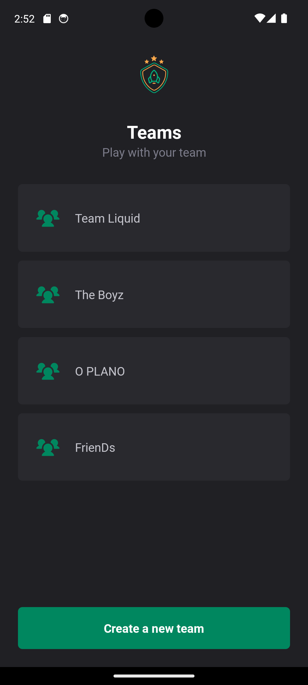
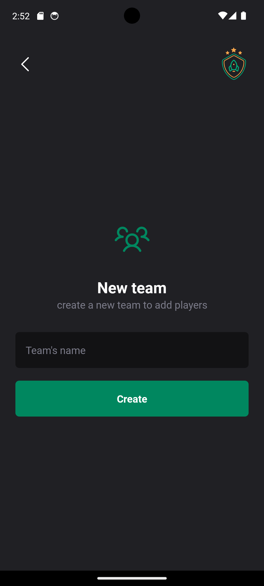
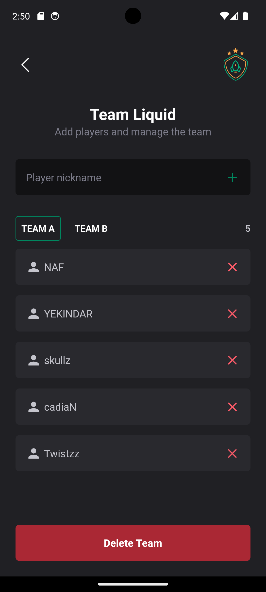

<h1 align="center">
  <div>
    
    <p>Ignite Teams</p>
  </div>
  <div>
    
    
    
    
    
  </div>
</h1>

## ✨ Description

This app is designed for gamers to manage their teams to play online.

Developed with 💜 during the React Native Ignite Bootcamp by Rocketseat.

## 🚀 Technologies
-  React Native
-  Expo
-  TypeScript
-  Styled-components
-  Phosphor Icons
-  Async Storage

## 💻 Installation

> Make sure you have Node.js installed on your machine.

1. Clone this repository <br />
```bash
git clone https://github.com/renatomarquesteles/rn-02-ignite-teams.git
```
2. Install the project dependencies <br />
```bash
npm install
```
3. Run the expo metro bundler <br />
```bash
npx expo start
```
4. Install the app "Expo Go" on your smartphone (available at Google Play Store and Apple Store)
5. Scan the QR Code that's showing in your terminal and wait for the installation on your smartphone

## 🌟 Preview

<div style="display:flex">
  
  
  
</div>
